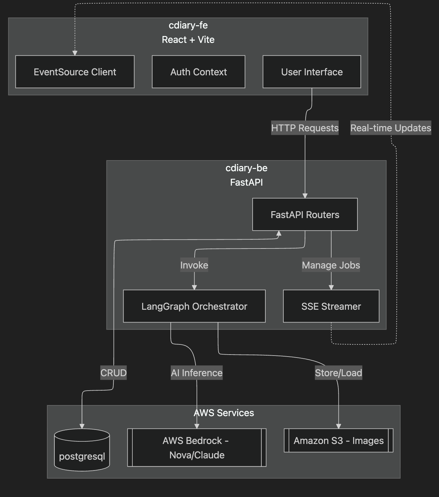
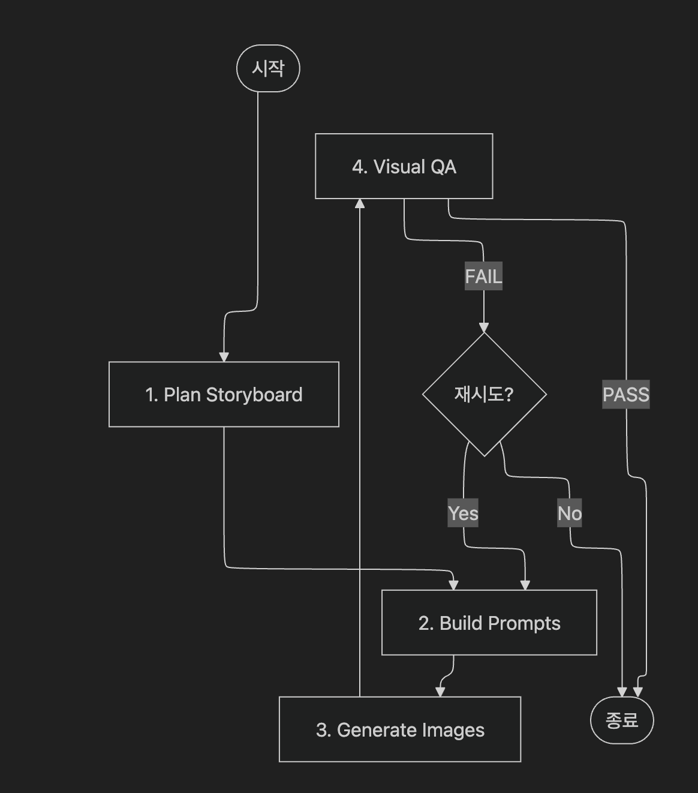

# 🎨 만화 일기

AI(AWS Nova)를 활용하여 일상의 생각을 4컷 만화로 변환해주는 스마트 일기 앱입니다. LangGraph 기반 에이전트 오케스트레이션과 SSE(Server-Sent Events)를 통해 실시간으로 진행 상황을 추적합니다.

## 🌟 주요 기능
- **일기 작성 및 캐릭터 맞춤 설정**: 사용자 프로필(성별, 나이 등)에 따라 일관된 캐릭터를 생성합니다.
- **자동 4컷 만화 생성**: 일기 내용을 분석하여 스토리보드를 구성하고 고품질 이미지를 생성합니다.
- **실시간 진행 상황 추적**: SSE(Server-Sent Events)를 통해 생성 단계를 실시간으로 업데이트합니다.
- **품질 보증 절차**: 멀티모달 AI 시각적 QA를 통해 품질을 검사하고 자동 재시도 기능을 제공합니다.
- **다국어 지원**: 한국어와 영어를 완벽하게 지원합니다.

---

## 📐 아키텍처

### 1. 시스템 아키텍처


### 2. AI 오케스트레이션 흐름


---

## 🏗️ 프로젝트 구조

### 1. 백엔드 (`cdiary-be`) - **AI 엔진 및 API**
FastAPI로 구축되었으며, LangGraph를 사용하여 복잡한 AI 워크플로우를 오케스트레이션합니다.

- **핵심 기술**:
  - **프레임워크**: FastAPI (Python 3.12 이상)
  - **AI 오케스트레이션**: LangGraph, LangChain
  - **LLM/LMM**: AWS Bedrock (Nova Canvas, Nova Text, Claude 3.5)
  - **데이터베이스**: SQLite (SQLAlchemy)
  - **저장소**: AWS S3 (이미지 및 참조 데이터 저장)
- **실행 방법**:
  ```bash
  cd cdiary-be
  python3 -m venv venv
  source venv/bin/activate  # Windows: venv\Scripts\activate
  pip install -r requirements.txt
  python main.py
  ```
  
### 2. 프런트엔드 (`cdiary-fe`) - **대화형 UI**
Vite와 React 기반의 반응성이 뛰어나고 시각적으로 아름다운 UI입니다.

- **핵심 기술**:
  - **프레임워크**: React 18 (TypeScript)
  - **빌드 도구**: Vite
  - **스타일링**: Tailwind CSS
  - **아이콘**: Lucide React
  - **상태 관리**: React Context API
- **실행 방법**:
  ```bash
  cd cdiary-fe
  npm install
  npm run dev
  ```

---
  
## 🚀 심층 분석: 핵심 메커니즘

### 📡 SSE(Server-Sent Events) 아키텍처
사용자가 다이어리 생성을 요청하면 백엔드는 즉시 `jobId`를 반환합니다. 프런트엔드는 SSE를 통해 실시간 상태 업데이트를 구독합니다.

- **엔드포인트**: `GET /api/jobs/stream?token=...`
- **워크플로우**:
  1. 클라이언트(`EventSource`)는 백엔드와 지속적인 연결을 유지합니다.
  2. 백엔드(Python 비동기 생성기)는 메모리에 저장된 `JOBS` 상태를 매초 직렬화합니다.
  3. 프런트엔드(`DiaryList.tsx`)는 수신된 데이터를 파싱하여 진행률 표시줄과 단계별 상태 텍스트를 업데이트합니다.
  4. 상태가 `DONE`이 되면 결과 화면으로 자동 전환됩니다.

### 🤖 AI 오케스트레이션(LangGraph Flow)
단순 프롬프트 실행 대신, 상태 기반 에이전트 워크플로를 활용하여 고품질 만화 제작을 보장합니다.

1. **스토리보드 계획**: 일기를 분석하여 요약, 감정, 장면 설명 및 대화를 포함하는 4컷 스토리보드를 생성합니다.
2. **프롬프트 생성**: 캐릭터 일관성 및 스타일 가이드라인을 적용하여 각 패널에 대한 이미지 생성 프롬프트를 구성합니다.
3. **이미지 생성**: 이전 패널을 참조하여 시각적 연속성을 유지하면서 AWS Nova Canvas를 호출하여 이미지를 생성합니다.
4. **시각적 품질 보증(비평)**: 멀티모달 모델이 생성된 이미지가 스토리보드의 의도와 일치하는지 검사합니다.
5. **재시도 루프**: 품질 보증 실패 시 실패 원인을 분석하고, 프롬프트를 조정하고, 설정된 제한 내에서 이미지 생성을 재시도합니다.
6. **완료**: 성공적으로 완료되면 아티팩트를 최종 확정하고 데이터베이스에 저장합니다.

---

## ☁️ 배포(AWS)

- **프런트엔드**: AWS Amplify(정적 웹 호스팅)
- **백엔드**: AWS App Runner(컨테이너화된 Python 서버)
- **저장소**: Amazon S3(생성된 이미지 제공)
- **AI**: AWS Bedrock(Nova 모델 제품군에 대한 액세스 필요)
